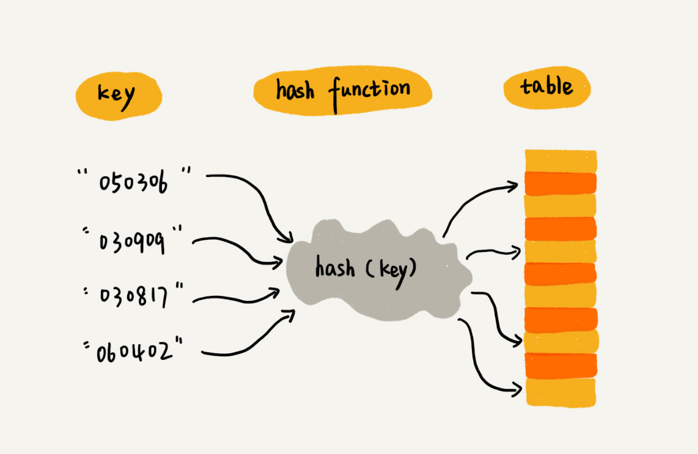

# 散列表
散列表(Hash table,也叫哈希表)，是根据键(Key)而直接访问在内存存储位置的数据结构。通过计算一个关于键值的函数，将所需查询的数据映射到表中一个位置来访问记录，这加快了查找速度。这个映射函数称为散列函数，存放记录的数组称为散列表  

**散列表用的是数组支持按照下标随机访问数据的特性，所以散列表其实就是数组的一种扩展**  



## 散列函数
定义为**hash(key)**  
- key表示元素的键值
- hash(key)的值表示经过散列函数计得到的散列值  

1. 散列函数计算得到的散列值是一个非负整数
2. 如果key1=key2,那hash(key1)==hash(key2)
3. 如果key1!=key2,那hash(key1)!=hash(key2)

## 散列冲突
对于散列表而言，无论设置的存储区域(n)多大，当需要存储的数据大于n时，那么必然会存在哈希值相同的情况，这就是所谓的**散列冲突**

### 1.开放寻址法
**如果出现了散列冲突，就重新探测一个空闲位置将其插入**  

黄色的色块表示空闲位置，橙色的色块表示已经存储了数据  
  

  

  

当散列表中插入的数据越来越多时，散列冲突发生的可能性就会越来越大，空闲位置会越来越少，线性探测的时间就会越来越久。  
极端情况下，需要探测整个散列表，时间复杂度为O(n)

#### 二次探测方法
使用二次探测进行探测的步长变成了原来的“二次方”  

hash(key)+0,hash(key)+1^2,hash(key)+2^2...

#### 双重散列方法
不仅使用**一组**散列函数：  
hash1(key),hash2(key),hash3(key)。。。  

先用第一个散列函数，如果计算得到的存储位置已经被占用，再用第二个散列函数，一次类推，直到找到空闲的存储位置

#### 转载因子(load factor)
表示空位的多少  

计算公式：  
```
散列表的装载因子 = 填入表中的元素个数/散列表的长度
```
装载因子越大，说明空闲位置越少，冲突越多，散列表的性能会下降

### 2.链表法
在散列表中，每个“桶(bucket)”或者“槽(slot)”会对应一条链表，所有散列值相同的元素都放到相同槽位对应的链表中  


