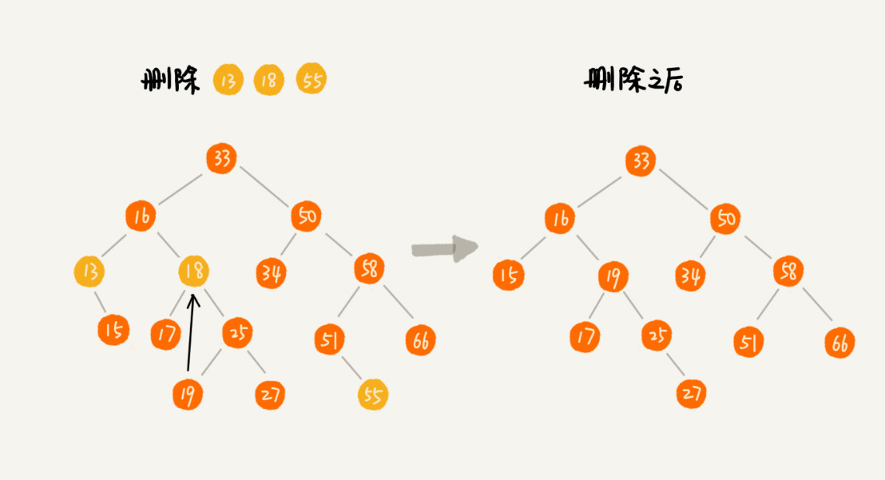

# 二叉查找树(Binary Search Tree)
二叉查找树要求，树中的任意一个节点，其左子树中的每个节点的值，都要小于这个节点的值，而右子树节点的值都大于这个节点的值  

## 查找操作
```
public class BinarySearchTree{
    private Node tree;

    public Node find(int data){
        Node p = tree;
        while(p != null){
            if(data < p.data) p = p.left;
            else if(data>p.data) p = p.right;
            else return p;
        }
        return null;
    }

    public static class Node{
        private int data;
        private Node left;
        private Node right;

        public Node(int data){
            this.data = data;
        }
    }
}
```

## 插入操作
  

```
public void insert(int data){
    if(tree == null){
        tree = new Node(data);
        return;
    }

    Node p = tree;
    while(p != null){
        if(data > p.data){
            if(p.right == null){
                p.right = new Node(data);
                return;
            }
            p = p.right;
        }else{  //data<p.data
            if(p.left == null){
                p.left = new Node(data);
                return;
            }
            p = p.left;
        }
    }
}
```

## 删除操作
1. 如果要删除的节点没有子节点，直接将父节点中，指向要删除节点的指针置为null
2. 如果要删除的节点只有一个子节点(只有左子节点或右子节点)，只需更新父节点中，指向要删除节点的指针，让它指向要删除节点的子节点就好了
3. 如果要删除的节点有两个子节点，需要找到这个节点的右子树中的最小节点，把它替换到要删除的节点上。然后再删除掉这个最小节点。  

  

```
public void delete(int data){
    Node p = tree;//p指向要删除的节点，初始化指向根节点
    Node pp = null;//pp记录的是p的父节点
    while(p != null && p.data != data){
        pp = p;
        if(data > p.data) p = p.right;
        else p = p.left;
    }
    if(p == null) return;//没有找到

    //要删除的节点有两个子节点
    if(p.left != null && p.right != null){
        //查找右子树中最小节点
        Node minP = p.right;
        Node minPP = p;//minPP表示minP的父节点
        while(minP.left != null){
            minPP = minP;
            minP = minP.left;
        }
        p.data = minP.data; //将minP的数据替换到p中
        //我们用后继节点替换到要删除节点的位置。 然后就变成删除后继节点的问题了。
        p = minP; //下面就变成了删除minP了
        pp = minPP;//pp记录的是p的父节点
    }

    //删除节点是叶子节点或者仅有一个子节点
    Node child; //p的子节点
    if(p.left != null) child = p.left;
    else if(p.right != null)child = p.right;
    else child = null;

    if(pp == null)tree = child;  // 删除的是根节点
    else if(pp.left == p)pp.left = child;
    else pp.right = child;
}
```