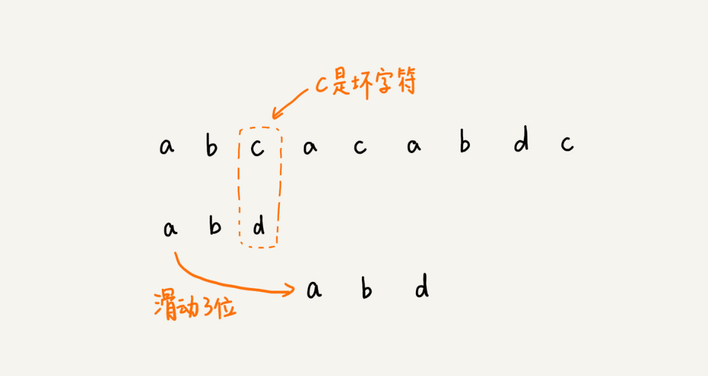

# BM算法
## 定义
BM算法的一个特点是当不匹配的时候**一次性可以跳过不止一个字符**。即它不需要对被搜索的字符串中的字符进行逐一比较，而会跳过其中某些部分。通常搜索关键字越长，算法速度越快。它的效率来自于这样的事实：对于每一次失败的匹配尝试，算法都能够使用这些信息来排除尽可能多的无法匹配的位置。

## 算法原理
### 1.坏字符规则(bad-character shift)
当文本串中的某个字符跟模式串的某个字符不匹配时，我们称文本串中的这个失配字符为坏字符，此时模式串需要向右移动，移动的位数 = 坏字符在模式串中的位置 – 坏字符在模式串中最右出现的位置。此外，如果”坏字符”不包含在模式串之中，则最右出现位置为 -1。坏字符针对的是文本串。  

  

  

### 2.好后缀规则(good-suffix shift)
当字符失配时，后移位数 = 好后缀在模式串中的位置 – 好后缀在模式串上一次出现的位置，且如果好后缀在模式串中没有再次出现，则为 -1。好后缀针对的是模式串。  

  

  

  

  

如果无法找到匹配好的后缀，找一个匹配的最长的前缀，让目标串与最长的前缀对齐（如果这个前缀存在的话）。模式串[m-s，m] = 模式串[0，s]  

