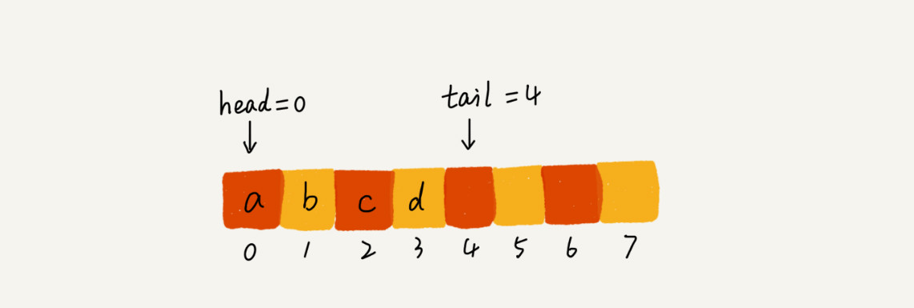

# 队列：队列在线程池等有限资源池中的应用


## 循序队列和链式队列
用数组实现的队列为**顺序队列**，用链表实现的队列为**链式队列**

### 用数组实现的队列
```
public class ArrayQueue{
    //数组：items,数组大小：n
    private String[] items;
    private int n = 0;
    //head表示队头下标，tail表示队尾下标
    private int head = 0;
    private int tail = 0;

    //申请一个大小为capacity的数组
    public ArrayQueue(int capacity){
        items = new String[capacity];
        n = capacity;
    }

    //入队
    public boolean enqueue(String item){
        //如果tail==n表示队列已经满了
        if(tail == n)return false;
        items[tail]=item;
        ++tail;
        return true;
    }

    //出队
    public String dequeue(){
        //如果head==tail表示队列为空
        if(head == tail)return null;
        String ret = items[head];
        ++head;
        return ret;
    }
}
```
当a,b,c,d依次入队后，队列中的head指针指向下标为0的位置，tail指针指向下标为4的位置  
  
两次出队后  
  

如果没有空闲空间了，我们只需要在入队时，再集中触发一次**数据的搬移操作**  
```
//入队操作，将item放入队尾
public boolean enqueue(String item){
    //tail==n表示队列末尾没有空间了
    if(tail==n){
        //tail==n&&head==0,表示整个队列都占满了
        if(head==0)return false;
        //数据搬移
        for(int i=head;i<tail;++i){
            items[i-head] = items[i];
        }
        //搬移完之后重新更新head和tail
        tail-=head;
        head = 0;
    }

    items[tail] = item;
    ++tail;
    return true;
}
```


### 基于链表的队列实现方法
两个指针：head指针和tail指针。分别指向链表的第一个节点和最后一个节点。  
入队时，tail->next = new_node,tail=tail->next;  
出队时，head=head->next。  


## 循环队列
  

队满时的判断公式：**(tail+1)%n=head**  

  

当队列队满时，tail指向的位置实际上是没有存储数据的。所以，循环队列会浪费一个数组的存储空间

```
public class CircularQueue{
    //数组：items,数组大小：n
    private String[] items;
    private int n = 0;
    //head表示队头下标，tail表示队尾下标
    private int head = 0;
    private int tail = 0;

    //申请一个大小为capacity的数组
    public CircularQueue(int capacity){
        items = new String[capacity];
        n = capacity;
    }

    //入队
    public boolean enqueue(String item){
        //队列满了
        if((tail+1)%n==head) return false;
        items[tail] = item;
        tail = (tail+1)%n;
        return true;
    }

    //出队
    public String dequeue(){
        //如果head==tail表示队列为空
        if(head == tail)return null;
        String ret = items[head];
        head = (head+1)%n;
        return ret;
    }
}
```

## 阻塞队列和并发队列
**阻塞队列**就是在队列的基础上增加阻塞操作  
就是在队列为空的时候，从队头取数据会被阻塞。  
如果队列已经满了，那么插入数据的操作会被阻塞，直到队列中有空闲位置后再插入数据，然后再返回  

  

线程安全的队列叫做**并发队列**。最简单直接的实现方式是直接在enqueue()、dequeue()方法上加锁，但是锁粒度并发度会比较低，同一时刻仅允许一个存或取操作。实际上，基于数组的循环队列，利用CAS原子操作，可以实现非常高效的并发队列。