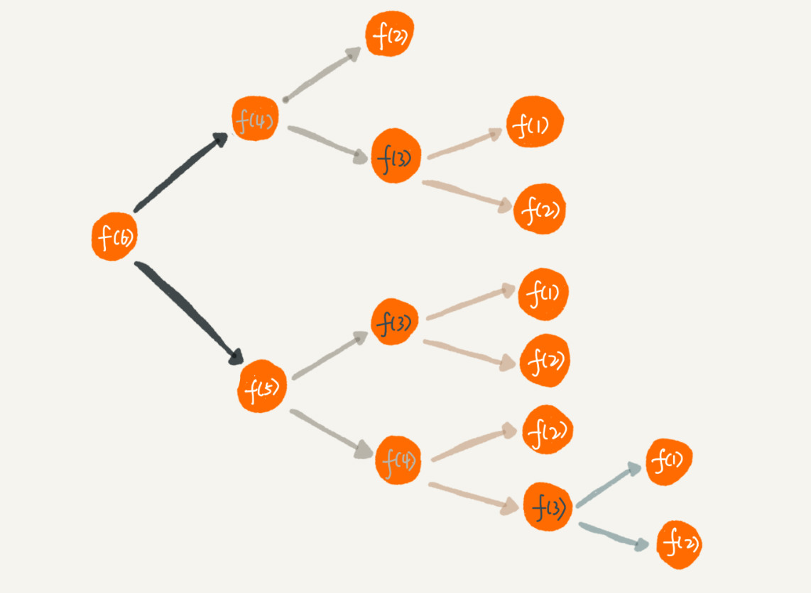

# 递归：如何用三行代码找到“最终推荐人”

## 递归代码要警惕重复计算
  

为了避免重复计算，可以利用一个数据结构(比如散列表)来保存已经求解过的f(k)。当递归调用到f(k)时，先看是否已经求解过。有，则直接从散列表中取出，避免重复计算。

```
public int f(int n){
    if(n == 1)return 1;
    if(n == 2)return 2;

    //hasSolvedList可以理解为一个Map,key是n,value是f(n)
    if(hasSolvedList.containsKey(n)){
        return hasSolvedList.get(n);
    }

    int ret = f(n-1)+f(n-2);
    hasSolvedList.put(n,ret);
    return ret;
}
```