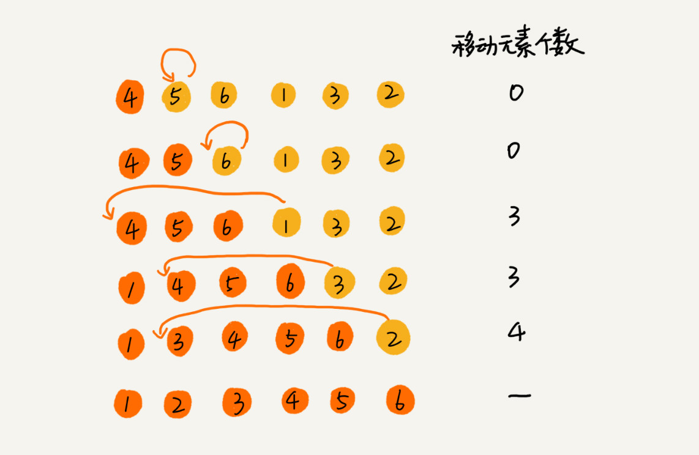

# 排序(上)


## 冒泡排序(Bubble Sort)
  

优化：当某次冒泡操作已经没有数据交换时，说明已经达到完全有序，不用继续执行后续的冒泡操作  
  

```
//冒泡排序，a表示数组，n表示数组大小
public volid bubbleSort(int[] a,int n){
    if(n<=1)return;

    for(int i=0;i<n;++i){
        //提前退出冒泡循环的标识位
        boolean flag = false;
        for(int j=0;j<n-i-1;++j){
            if(a[j]>a[j+1]){
                int tmp = a[j];
                a[j] = a[j+1];
                a[j+1] = tmp;
                flag = true;//表示有数据交换
            }
        }
        if(!flag)break;//没有数据交换，提前退出
    }
}
```


## 插入排序(Insertion Sort)
1. 将第一待排序序列第一个元素看作一个有序序列，把第二个元素到最后一个元素当作是未排序序列
2. 从头到尾依次扫描未排序序列，将扫描到的每个元素插入有序序列的适当位置。(如果待插入的元素与有序序列中的某个元素相等，则将待插入元素插入到相等元素的后面)



```
function insertionSort(arr){
    var len = arr.length;
    var preIndex,current;
    for(var i=1;i<len;i++){
        preIndex = i - 1;
        current = arr[i];
        while(preIndex >= 0 && arr[preIndex]>current){
            arr[preIndex+1] = arr[preIndex];
            preIndex--;
        }
        arr[preIndex+1] = current;
    }
    return arr;
}
```

## 选择排序(Selection Sort)
1. 首先在未排序序列中找到最小(大)元素，存放到排序序列的起始位置
2. 再从剩余未排序元素中继续寻找最小(大)元素，然后放到已排序序列的末尾
3. 重复第二步，直到所有元素均排序完毕

  

```
function selectionSort(arr){
    var len = arr.length;
    var minIndex,temp;
    for(var i=0;i<len-1;i++){
        minIndex = i;
        for(var j=i+1;j<len;j++){
            //寻找最小的数
            if(arr[i]<arr[minIndex]){
                //将最小数的索引保存
                minIndex = j;
            }
        }
        temp = arr[i];
        arr[i] = arr[minIndex];
        arr[minIndex] = temp;
    }
    return arr;
}
```

